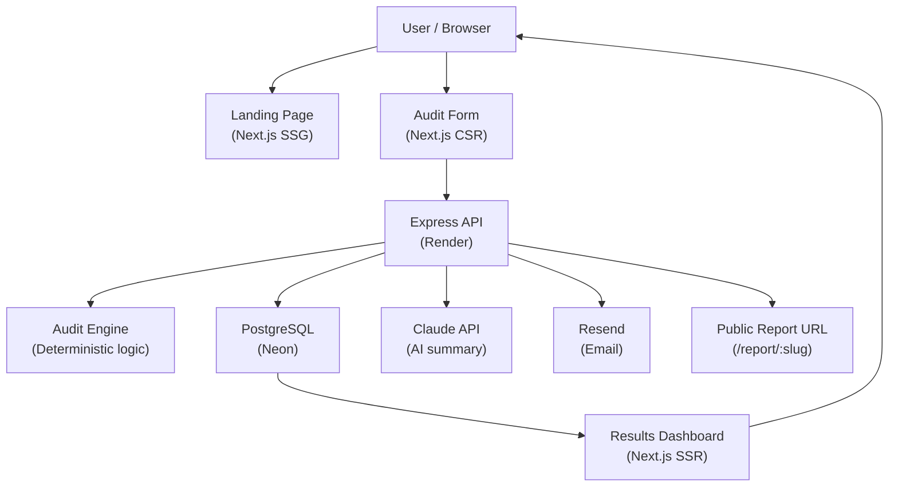

# Architecture

## System diagram

## Data flow

1. User fills 3-step form with AI tool subscriptions
2. Frontend sends POST /api/audit with tools, plans, seats, prices
3. Express validates input with Zod, sanitizes strings with xss library
4. Audit engine runs deterministic rules against each subscription
5. Results saved to PostgreSQL with a unique 6-char share slug
6. Report returned to frontend — user sees results instantly
7. Frontend separately calls POST /api/summary (async, non-blocking)
8. Claude API generates 2-3 sentence personalized summary
9. Summary saved to report record and displayed when ready
10. User optionally enters email — lead saved, Resend sends confirmation

## Why this stack

**Next.js 15** — App Router gives us SSR for report pages (OG tags work for social sharing), static generation for landing page (fast TTI), and client components for interactive forms. One framework covers all three patterns.

**Express.js separate from Next.js** — The audit engine and Prisma logic should be independently deployable and testable. Keeping the API separate means it can be consumed by future products (mobile app, embeddable widget) without touching the frontend.

**PostgreSQL + Prisma** — Relational model fits naturally: one report has many subscriptions, one subscription belongs to one report. Prisma gives us type-safe queries — no raw SQL strings that can drift from the schema.

**Zod for validation** — Runtime validation at the API boundary. TypeScript types are compile-time only; Zod catches malformed requests before they touch the database. Same schemas can be shared with the frontend for form validation.

**Deterministic audit engine** — The savings recommendations use hardcoded rules, not AI. This is intentional: the recommendations need to be defensible to a finance person. AI-generated recommendations would be unpredictable and hard to audit. We use AI only for the summary paragraph where creativity helps.

**Neon for Postgres** — Serverless Postgres with connection pooling built in. Free tier covers this project comfortably. Automatic branching for preview environments is a future benefit.

## What I would change at 10k audits per day

1. **Cache audit results** — Add Redis (Upstash free tier) to cache GET /api/report/:slug responses. Most report views are reads of existing data.

2. **Queue the AI summary** — Move POST /api/summary to a background job (BullMQ + Redis). Currently it's a synchronous HTTP call that blocks if Claude API is slow.

3. **Read replica** — Split read traffic (report fetches, stats) to a read replica. Neon supports this natively.

4. **CDN for static assets** — Next.js on Vercel already handles this, but the Three.js bundle (~500KB) should be code-split more aggressively.

5. **Rate limiting by user fingerprint** — Current rate limiting is IP-based. At scale, use a combination of IP + browser fingerprint to handle users behind shared IPs (offices, universities).

6. **Audit engine as a separate package** — Extract the audit engine to packages/engine so it can be imported by a future API v2 or CLI tool without depending on the Express layer.
